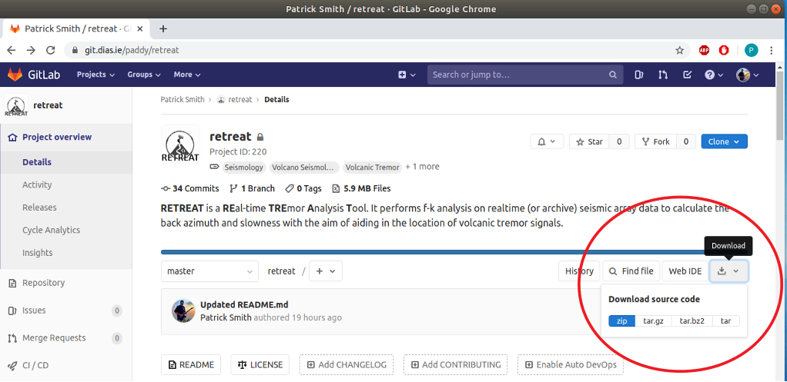
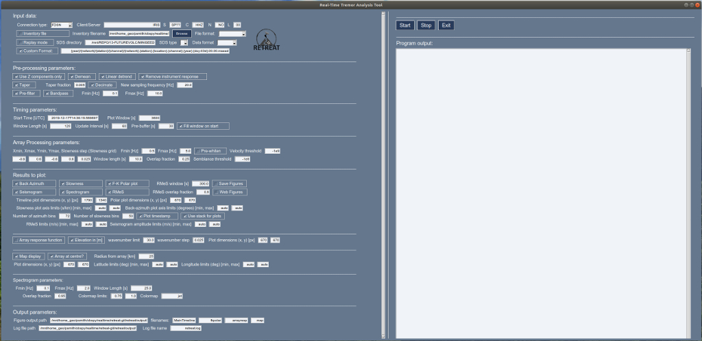
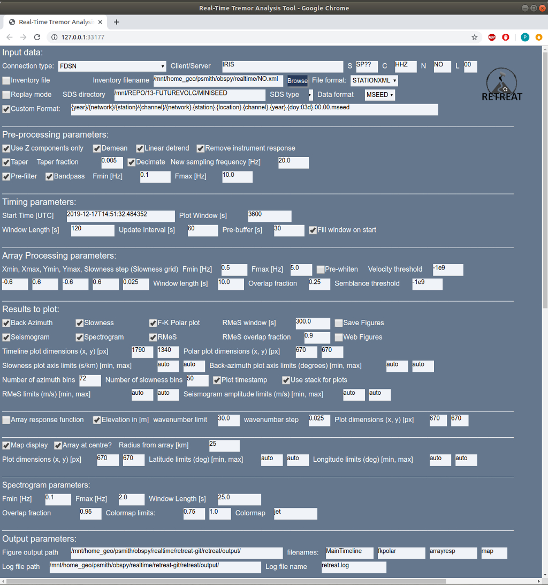
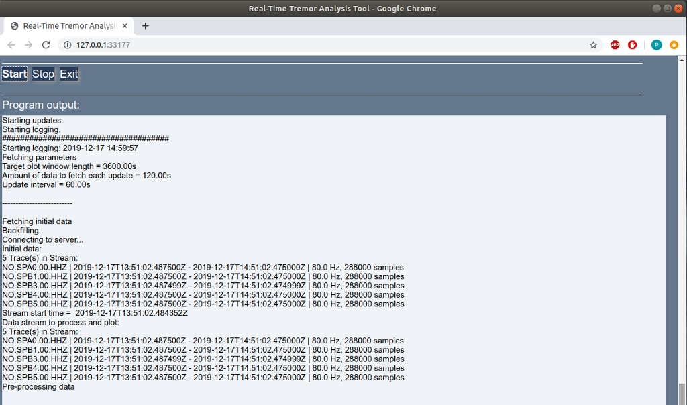
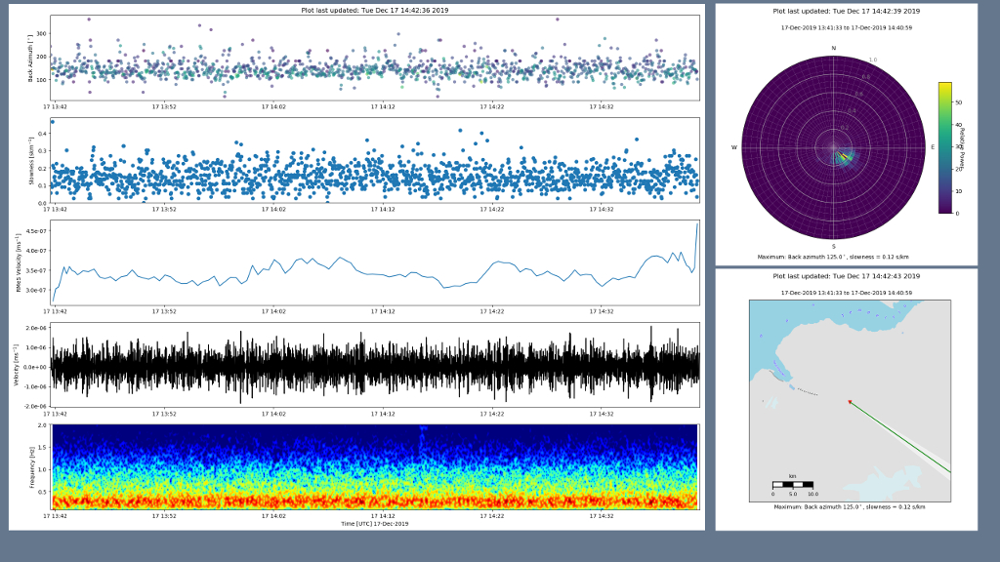
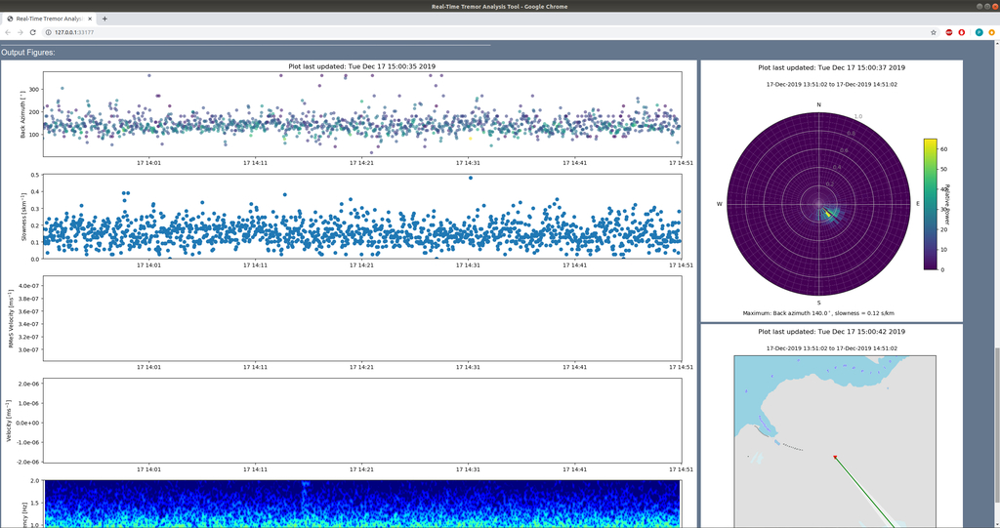
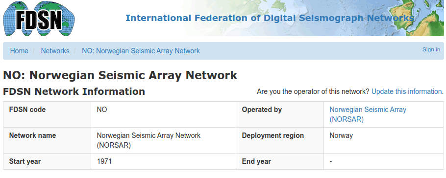
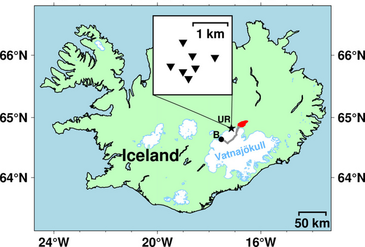

# RETREAT - *RE*al-time *TRE*mor *A*nalysis *T*ool
|||
|---|---|
|**RETREAT** is a **RE**al-time **TRE**mor **A**nalysis **T**ool written in python, making use of the [*ObsPy*](https://www.obspy.org/) framework. It performs beamforming on real-time (or optionally archive) seismic array data to calculate the back azimuth and slowness values in a given time window, with the aim of aiding in the location of volcanic tremor signals.||
[](https://zenodo.org/badge/latestdoi/263127922)

## Background 

The [EUROVOLC](https://eurovolc.eu/) project aims to promote an integrated and harmonised European volcanological community, and one of its main themes focuses on understanding sub-surface processes. Early identification of magma moving towards the surface is very important for mitigation of volcanic hazards, and joint research activities within the project aim to develop volcano pre-eruptive detection schemes. 

Volcanic tremor is a sustained seismic signal associated with eruptions and is often linked to movement of magmatic fluids in the subsurface. However, it can occur pre-, syn- and post-eruption, and signals with similar spectral content can be generated by several other processes (e.g. flooding, rockfalls). Hence one of the best ways of distinguishing between the processes underlying tremor generation is its 3D location. As tremor cannot be located using classical seismological methods, its source must be determined using alternatives such as amplitude-based techniques or seismic array analysis.

Dense, small-aperture arrays are particularly suited for analyzing volcanic tremor, yet costs associated with installation and maintenance have meant few long-term or permanent seismic arrays in use for routine monitoring. Therefore, to facilitate greater use of arrays in tracking volcanic tremor sources, we present **RETREAT** - a **RE**al-time **TRE**mor **A**nalysis **T**ool.

This software tool uses seismic array data and array processing techniques to help detect, quantify and locate volcanic tremor signals. It is a python-based tool that utilises existing routines from the open-source *ObsPy* framework to carry out analysis of seismic array data in real-time. The tool performs beamforming using f-k (frequency-wavenumber) analysis, or a Least-squares inversion, to calculate the back azimuth and slowness in overlapping time windows, which can be used to detect and track the location of volcanic tremor sources.  While primarily intended as a tool for utilizing seismic array data to locate and track volcanic tremor, RETREAT also has the capability to analyze infrasonic array data to track acoustic sources.

## Installation

#### Download

If you wish to use *git* you can download the latest version of the software by cloning the repository to a suitable location by typing:

>```git clone --recursive https://git.dias.ie/paddy/retreat```

Or alternatively click on the download button (at the top of the page, below the project description) to download the source code as a zip, tar or compressed archive file:



#### Setup

After you have cloned or downloaded the software, navigate to the repository directory, or unzip/untar the source code to a suitable directory. The contents of the repository should look something like this:

```
retreat
├── CONTRIBUTORS.md
├── doc
│   ├── DIAS_logo.jpg
│   ├── Eurovolc-header-1.jpg
│   ├── EUROVOLC-logo-32.png
│   ├── EUROVOLC-logo.jpg
│   ├── IRIS-NORSAR1.jpg
│   ├── IRIS-NORSAR2.jpg
│   ├── retreat_trans128.png
│   ├── retreat_trans192.png
│   ├── retreat_trans48.png
│   ├── retreat_trans96.png
│   ├── screenshots
│   │   ├── retreat-buttons.jpg
│   │   ├── retreat-gitlab-download.png
│   │   ├── retreat_GUI_figwindow.jpg
│   │   ├── retreat_GUI.jpg
│   │   ├── retreat_GUI_output.jpg
│   │   ├── retreat_WEB_bottom.jpg
│   │   ├── retreat_WEB_figwindow.jpg
│   │   ├── retreat_WEB_output.jpg
│   │   └── retreat_WEB_top.jpg
│   └── UR-array-map.png
├── LICENSE.txt
├── README.md
├── requirements.txt
└── retreat
    ├── data
    │   ├── array_preproc.py
    │   ├── beamforming_lsqr.py
    │   ├── fdsn2st3.py
    │   ├── fix_times.py
    │   ├── get_array_response.py
    │   ├── get_meta.py
    │   ├── __init__.py
    │   ├── sds2st3.py
    │   ├── slink2st3.py
    │   └── stack.py
    ├── defaults
    │   ├── default_input_values.py
    │   ├── default_input_values.py.NO
    │   ├── default_input_values.py.UR
    │   └── __init__.py
    ├── example_data
    │   ├── dataless.seed.UR
    │   ├── NO.xml
    │   ├── VI.URA..HHZ.2014.246.00.00.mseed
    │   ├── VI.URB..HHZ.2014.246.00.00.mseed
    │   ├── VI.URD..HHZ.2014.246.00.00.mseed
    │   ├── VI.URE..HHZ.2014.246.00.00.mseed
    │   ├── VI.URF..HHZ.2014.246.00.00.mseed
    │   ├── VI.URG..HHZ.2014.246.00.00.mseed
    │   └── VI.URH..HHZ.2014.246.00.00.mseed
    ├── gui
    │   ├── get_param_gui.py
    │   ├── gui_layout.py
    │   ├── gui_sizes.py
    │   └── __init__.py
    ├── __init__.py
    ├── __main__.py
    ├── plot
    │   ├── add_logos.py
    │   ├── __init__.py
    │   ├── mapping.py
    │   ├── rms_rmes.py
    │   ├── set_font_sizes.py
    │   ├── shiftedColorMap.py
    │   └── update_plot.py
    ├── realtime.py
    ├── start.py
    ├── tools
    │   ├── __init__.py
    │   ├── KThread.py
    │   ├── monitoring_routines.py
    │   ├── processpool.py
    │   └── time_to_wait.py
    └── update.py
```

Next, check and install all the required software and packages by following the instructions in the next section.

#### Requirements

This software requires python3. A list of required python modules is contained in the _requirements.txt_ file.

These are:

- scipy (```python3-scipy```)
- matplotlib (```python3-matplotlib```)
- numpy (```python3-numpy```)
- regex (```python3-regex```)
- obspy (```python3-obspy```)
- psutil (```python3-psutil```)
- Pillow (```python3-pil```)
- Cartopy (```python3-cartopy```)
- PySimpleGUI
- PySimpleGUIWeb

More information on *obspy* and *PySimpleGUI* is available from:

[https://www.obspy.org/]() and [https://pysimplegui.readthedocs.io/en/latest/#install]()

Ubuntu/Debian package names are shown in brackets where available, and can be installed via: 

><code>sudo apt-get install *packagename*</code>

To install the required modules using **pip**, you can type the following:

>```pip3 install -r /path/to/requirements.txt```

Finally, to start the software follow the instructions below.

## Starting the software

The **RETREAT** package can be run in 2 modes:

1. With a GUI interface, running in its own window
2. With a web interface, where the input and output is displayed in a browser

### GUI window

This the default mode. In a terminal window navigate to the directory you cloned or downloaded to and type:

>```python3 -m retreat```

This will start the software and open a GUI window that should look something like this:



with the Input Parameters in the left hand pane, and the Control Buttons and Output Pane on the right hand side. 
Figures will appear in a *new window*.

### Web interface

To run the software with a web interface in a browser, do the same as above, but simply give the ``-w`` command line argument, i.e. :

>```python3 -m retreat -w```

This will start the software and open a new tab in your browser and should look like this:



with the Input Parameters listed at the top of the page,


and the Control Buttons and Output Pane visible below if you scroll down the page.
Figures will appear *below the Output Pane*.

## Description of Input Parameters

### Input Data

These parameters define the source and properties of the input data. The fields are:

* **Connection type** - Used for realtime data only. Can currently use the dropbox to choose from an FDSN, seedlink or earthworm/winston client.
* **Client/Server** - Details of the server for the chosen connection type. For FDSN this is simply the name, e.g. *IRIS*, and for Seedlink or earthworm/winston servers this is the server URL:port, e.g. *rtserve.iris.washington.edu:18000* or *pubavo1.wr.usgs.gov:16022*
* **SCNL** - These specify the data Station, Channel, Network and Location codes for the input data (wildcard "*" can be used)
* **Inventory file** - checkbox to specify if you are supplying an inventory or metadata file (required if Connection type is **not** FDSN or if using archive data)
* **Inventory filename** - Path and name of inventory file (you can also use the *Browse* button to select)
* **File format** - Specify format of inventory file. You can use all formats supported by *obspy* (including: STATIONXML, dataless SEED, XSEED). RESP format is NOT supported as RESP files do not contain station coordinates. While a proper full inventory file is preferred, the only essential metadata required is the station locations. If you do not have an inventory for your network you can supply the station coordinates in a plain text file (choose ASCII format), with the following 4 columns: SEED_id (i.e. N.S.L.C), longitude, latitude, elevation. e.g.
>```
>NO.SPA0.00.HHZ 16.36998 78.177711 323.0
>```

>Note that if ASCII format is selected then you are unable select the pre-processing option to remove the [instrument response](#remove_resp) (as no response information was supplied in the inventory). See also [this note](#coords) on coordinate specification.

* **Replay mode** - checkbox for replay or archive data. Leave unchecked for real-time data.
* **SDS directory** - path to the root of an SDS (Seiscomp Directory Structure - you can also use the *Browse* button to select)
* **SDS type** - dropdown box to choose value for the *TYPE* field of the SDS
* **Data format** - format of the waveform data. You can use all formats supported by *obspy* (including: MSEED, SAC, SEISAN, GCF)
* **Custom Format** - checkbox to specify if you are using a non-standard SDS structure. If so, fill in your format in the box. Can be specified as {year}/{network}/{station}/{channel}/ etc. See the *obspy* [source code](https://docs.obspy.org/_modules/obspy/clients/filesystem/sds.html) for more details and examples.

### Pre-processing

These parameters define any pre-processing applied to the data before the array analysis is carried out. The fields are:

* **Use Z-components only** - checkbox to select only vertical (Z) components from the stream (checked by default)
* **Demean** - checkbox to select whether to subtract the mean from each trace
* **Linear detrend** - checkbox to select whether to remove a linear trend from the data
<a name="remove_resp"></a>
* **Remove instrument response** - checkbox to select whether to remove the instrument response (output is velocity)
* **Taper** -  checkbox to select whether to apply a taper to the data
* **Taper fraction** - length of taper to apply (as a fraction of the window length)
* **Decimate** - checkbox to select whether to decimate or downsample the data (less data, speeds up array processing)
* **New sampling frequency** - specify the new sampling frequency to downsample to if the *Decimate* box is checked
* **Pre-filter**- checkbox to select whether to Pre-filter the data
* **Bandpass** - checkbox to select whether to Bandpass filter the data. The next 2 boxes specify the upper and lower frequency limits (in Hz) for the filter
* **Check for gaps** - checkbox to select whether to check for and attempt to fill gaps in the input data stream. This function is designed to ensure RETREAT continues to run if small gaps or dropouts occur in the data. Gaps are currently filled with the trace mean or zero (if demean option selected).
* **Minimum number of channels** - the minimum number of good (gap-free or suitably filled) channels required to proceed with the array analysis.
* **Maximum fillable gap size** - the size of the maximum gap that should be filled (in seconds)
* **Max. gap to fill at start/end** - the size of the maximum gap (in seconds) to be filled at the start or end of each trace, e.g. for channels that start late or finish early within the window

### Timing

This set of parameters define the amount of data to be processed, by defining the length of the window and how often it is updated (real-time mode). The parameters are:

* **Start Time** - specify the start time (UTC). This defaults to the current time (when software is started) when using real-time mode. It also accepts the keyword term '*now*'.
* **Plot window** - length of the window to be plotted in the output figure timeseries (in seconds)
* **Max realtime latency** - to account for latency of incoming data and to ensure real-time processing does not lag too much, you can specify the maximum number of seconds to allow for latency. If the delay between the end of the acquired data stream and the current time exceeds this value then processing will proceed immediately without waiting for the update interval. This parameter has no effect for archive data in replay mode.
* **Window length** - amount of data to fetch on each update (in seconds)
* **Update interval** - How often to update (fetch new data) - specified in seconds. If the processing for each update step takes longer than this update interval to complete, the software will warn you that realtime processing may lag. NOTE: for non-realtime/archive data this parameter is ignored and the next chunk of data is processed immediately.
* **Pre-buffer** - amount to pre-buffer (in seconds) before the start time to ensure there are no gaps in the data stream. This is only relevant for real-time mode
* **Fill window on start** - if this box is checked the software will fetch enough data to fill the entire window (specified by the *Plot window*) on the first update. Otherwise, it will fetch only *Window length* seconds and the window will grow with each update until it reaches the length of the *Plot Window*
* **End time** - optionally specify the end time (UTC), Default=None. Note that this only applies for replay mode. RETREAT will attempt to continue beyond the end of the dataset (in case of large gaps/outages in all or multiple channels), and will continue to search forward for more data  indefinitely unless an end time is explicitly specified. Note that for real-time mode, the analysis continues indefinitely until stopped, and RETREAT will attempt to reconnect to the server/data source if the connection is lost.

### Array Processing parameters

Sets parameters for the array processing, using the standard *array_analysis* routines in *obspy*. See the *obspy* documentation [here](https://docs.obspy.org/packages/autogen/obspy.signal.array_analysis.array_processing.html#obspy.signal.array_analysis.array_processing). The choice of these values will depend very much on the specific array being used. 

* The first set of 5 values define the **slowness grid** over which to perform the beamforming. These are the minimum and maximum slowness values in the *x*- and *y*-directions, and the desired slowness step (or resolution).

The next 2 parameters define the bandpass filter limits:

* **Fmin** and **Fmax** - define the minimum and maximum frequency (in Hz) for the f-k analysis

To provide a timeseries output, the f-k analysis is performed by using shorter time windows and sliding these windows across the entire trace.

* **Window length** - defines the sliding window length (in seconds)
* **Overlap fraction** - defines the amount to overlap each window [0,1] (a higher value will increase the time resolution and hence processing time)

Other parameters:

* **Pre-whiten** - checkbox to select whether to Pre-whiten the data (unchecked/disabled by default)
* **Velocity threshold** - Threshold for velocity for f-k analysis
* **Semblance threshold** - Threshold for semblance for f-k analysis

Finally, there is also an option to use a Least-Squares beamforming method as an alternative to f-k, e.g. for infrasound data where lower velocity/higher slowness values mean a large slowness grid is required which can impact the computation time. This method is described in [De Angelis et al. (2020)](https://doi.org/10.3389/feart.2020.00169), and allows for significantly faster computation. The python routine implementing the method in this software were adapted from the matlab code available [here](https://github.com/silvioda/Infrasound-Array-Processing-Matlab).

* **LSQ beamforming** - checkbox to select whether to use Least-Squares beamforming instead of standard f-k analysis. Note that if checked, most of the array parameters are redundant, and only the **Window length** and **Overlap fraction** values still apply. Note that histogram output for any polar [plot](#results-and-plots) is now weighted by the correlation (MCCM), rather than being weighted by the power as in the f-k case. This method also returns timeseries of the errors in (apparent) velocity and back-azimuth - and the azimuth errors are used for the error cone in the optional map plot in this case.

---

<a name="coords"></a> 
Note on **coordinates**: although the *obspy* array_processing module accepts coordinates as either Cartesian (*xy*) or latitude and longitude (*lonlat*), for convenience in plotting the array response function and map of the array, please note that latitude and longitude (*lonlat*) format is assumed. Therefore, *please ensure your station coordinates are specified as latitude and longitude* in your station metadata/inventory file.
 
### Results and Plots

The parameters in this section define what you wish to plot as the output of the analysis as well as various settings for these figures. For more details and examples see the [Figures](#figures-and-output) section. The main timeseries figure can have up to 7 panels, with the desired output selected by the 7 checkboxes:

* **Back azimuth** - checkbox to select to plot a timeseries of the calculated back azimuths (in degrees)
* **Slowness** - checkbox to select to plot a timeseries of the calculated slowness (in s/km)
* **Power/MCCM** - checkbox to select to plot a timeseries of the relative power [f-k] or MCCM (mean maximum correlation) [Least-squares]
* **Seismogram** - checkbox to select to plot the (filtered) seismogram
* **Spectrogram** - checkbox to select to plot a spectrogram of the data
* **RMeS** - checkbox to select to plot the RMeS envelope (Root-Median-Square)

RMeS is the envelope of the seismogram calculated using a Root-Median-Square sliding window. The parameters than control this are:

* **RMeS Window** - length of the window to calculate RMeS in seconds
* **Overlap fraction** - defines the amount to overlap each window [0,1] (a higher value will increase the time resolution and hence processing time)

The checkbox **Polar plot** creates a separate figure with the power from the beamforming analysis represented in *Polar* form as a histogram, with the *Back azimuth* on the *angular* axis, and the *slowness* on the *radial* axis. Note for Least-squares beamforming this is weighted by the MCCM rather than relative power.

* **Save figures** - checkbox to select whether to save each figure. If checked each update will save the figure as a NEW file with a unique filename based on the timestamp. Otherwise, if unchecked, the same image file is overwritten on each update.
* **Web Figures** - checkbox to select whether to display output figures in a web browser rather than a separate GUI window (**NOTE** this the default if the software is started in Web interface mode and cannot be changed)
* **Plot logos** - checkbox for whether to add RETREAT and EUROVOLC logos to the output figures (enabled by default)

The next set of parameters define the size of the output figures, as pairs of *x* and *y* values. The sizes are specified in *pixels* (resolution is set to 100 DPI):

* **Timeline plot dimensions** - size of main timeline figure (with up to 5 panels)
* **Polar plot dimensions** - size of f-k polar form figure 

Fixed *y*-axis limits for the various figures can also be set. If set to *auto* the figure will automatically scale the axes:

* **Slowness plot(s) axis limits** - minimum and maximum slowness values for the *y*-axis of the timeline AND radial axis of power plot (in s/km)
* **Back-azimuth plot axis limits** - minimum and maximum azimuth values for the *y*-axis (in degrees)

You can also define the resolution for the histogram in the polar representation of the results:

* **Number of azimuth bins** - It is expected that 360 divided by this number is an integer
* **Number of slowness bins** - Higher values increase the resolution but take longer to process

Other options include:

* **Plot timestamp** - if checked this will print the timestamp onto each figure (*current* time if in real-time mode OR stream start time if in archive mode)
* **Use stack for plots** - if checked a *stack* of the traces in the array will be used as the *seismogram* plot. Otherwise the first station in the stream is used. The stack used is the beam corresponding to the slowness and backazimuth values derived from the maximum relative power.
* **Normalized histogram** - if checked normalizes the power or MCCM in the histogram for the Polar plot, based on the maximum possible value (i.e. if there was perfect correlation/coherence for every value in the timeseries)
* **RMeS limits** - minimum and maximum velocity values for the RMeS panel *y*-axis (in m/s). If set to *auto* the figure will automatically scale the axes
* **Seismogram amplitude limits** - minimum and maximum velocity values for the *y*-axis (in m/s). Again, if set to *auto* the figure will automatically scale the axes
* **Power/MCCM limits** - minimum and maximum velocity values for the *y*-axis. Again, if set to *auto* the figure will automatically scale the axes.

The next set of values control the (optional) plot of the array response function:

* **Array response function** - checkbox to select whether to produce a plot of the array response function. Note that *only one of* the array response function or map can be selected.

* **Elevation in [m]** - checkbox to determine if elevation values are given in metres. If unchecked elevation values in kilometres are assumed.

The wavenumber grid over which to evaluate the array response must also be defined:

* **wavenumber limit** - limit or maximum wavenumber to analyze (assumed symmetric grid: *-klim* to *+klim* in both *x* and *y*-directions)
* **wavenumber step** - wavenumber step or resolution of grid

see [here](https://docs.obspy.org/tutorial/code_snippets/array_response_function.html) for the *obspy* documentation and an example of plotting the array response function.

* **Plot dimensions** - size of the output figure (*x* and *y* values) specified in *pixels*.

The final set of values control the (optional) map of the array, overlain by the calculated back azimuths:

* **Map display** - checkbox to select whether to produce a map using data from [OpenTopoMap](https://wiki.openstreetmap.org/wiki/OpenTopoMap). A working internet connection is required to download the relevant tiles. Note that *only one of* the array response function or map can be selected.
* **Array at centre** - checkbox to select whether to have the array at the centre of the map
* **Radius from array** - If array is at the centre of the map, this value defines a radius (in km) to automatically determine the map extent.
* **Plot dimensions** - size of the map figure (*x* and *y* values) specified in *pixels*.

The *x*- and *y*-axis limits of the map extent can also be manually specified. If the array at centre checkbox is **NOT** checked, these values **MUST** be given. Else, if set to *auto* the figure will automatically scale the axes.

* **Latitude limits** - manually specify the latitude axis limits (min, max) in degrees.
* **Longitude limits**- manually specify the latitude axis limits (min, max) in degrees.

If set to *auto* the figure will automatically scale the axes (for array at centre checked)

#### Spectrogram 

A separate section contains the settings for controlling the spectrogram figure (if selected to plot):

* **Fmin** - minimum limit for the frequency (*y*-) axis.
* **Fmax** - maximum limit for the frequency (*y*-) axis.

The length and overlap of the FFT window used are controlled by:

* **Window length** - length of the window to calculate FFT in seconds
* **Overlap fraction** - defines the amount to overlap each window [0,1]

The colormap and limits of the colour scale for the spectrogram are given by:

* **Colormap limits** - minimum and maximum values (normalised)
* **Colormap** - name of colormap to use for the spectrogram. For a list of colormaps available for matplotlib, see [https://matplotlib.org/3.1.0/tutorials/colors/colormaps.html](https://matplotlib.org/3.1.0/tutorials/colors/colormaps.html).

### Output

These settings control where the output produced by the software is placed on your system. The parameters are:

* **Figure output path** - full path to where to store output figures and plots. (default is: *retreat/output/*). The next 4 boxes are the **filenames** for the different output figures: *MainTimeline*, *fkpolar*, *arrayresp*, and *map* (in order). Note that if the **Save Figures** checkbox is selected (see above) then these names will be appended by a unique string based on the timestamp.

* **Log file path** - full path to where to store the logfile. The accompanying box specifies the log file **filename**.

* **Save data** - checkbox to select whether raw data from each update of the array processing is saved to disk. If checked then on each update an ASCII text file is written containing 3 columns: 1) *time* (in matplotlib date format - see [here](https://matplotlib.org/api/dates_api.html#matplotlib-date-format)), 2) *backazimuth* (in degrees) and 3) *slowness* (in  s/km)). The name of the output text files is specified by the **filename**, appended by a unique string based on the network and timestamp. Note that the files are saved in the same directory as specified by **Figure output path**.

### Default values

All parameters that can be set using the GUI or web interface can also be defined in advance of runtime. This is controlled by the **default_input_values.py** file in the *retreat/defaults* directory, which contains a simple python dictionary comprising of pairs of parameters and their default values. e.g:

```
defaults = dict(
        #########################
        # DATA SOURCES - REALTIME
        myclient="IRIS",
        connection=['FDSN', 'seedlink'],
        ...
        ...
        ...
        arrayfigname="arrayresp",
        mapfigname="map",
        ########################
    )
```
This file can be easily edited to change the default values as desired.

The repository also contains two examples files containing default values that can be used to run the two examples described in the [Examples](#examples) section. These are:

>```default_input_values.py.NO```

which contains values to run the *real-time* data example, using data from the SPITS/NORSAR (NO) array

and

>```default_input_values.py.UR```

which contains values to run the *archive* data example, using data from the B&aacute;r&eth;arbunga (UR) array.

## Control Buttons

There are 3 simple buttons to control the software:


* **Start** - pressing this will start the data acquisition (either real-time or from archive files), carry out the array processing, produce the output figures and then update/repeat as specified. This continues indefinitely until stopped.

* **Stop** - pressing this button stops the computation

* **Exit** - Closes the window and exits from the program

## Figures and Output

### Output window

In both GUI and web mode, the interface displays an output pane that shows the output produced once the **Start** button is pressed. The text displayed on screen is the same as the messages that are written to the log file. Note that the logfile will be overwritten by default when the software is run, unless a different name is specified in the input parameters.
<!--This is achieved using the *pygtail* module, which updates the output pane by printing log file lines that have not been read. -->



### Figure window

In both GUI and web mode, the interface also has a figure window that shows the output figures that are produced once the **Start** button is pressed.

In GUI mode this will open as a *new* window:



whereas in web mode, figures are displayed in the *same* browser window, *below* the output pane:



## Examples

Two example configuration files are included with the source code to demonstrate how the tool can be used for both real-time and archive data.

### 1. *Real-time* mode using data from SPITS array

The first example uses real-time data from the small-aperture SPITS array in Spitsbergen, part of the larger [NORSAR](https://www.fdsn.org/networks/detail/NO/) array:



Data is acquired in real-time from [IRIS](https://www.iris.edu/hq/) via the *obspy* [FDSN](https://docs.obspy.org/packages/obspy.clients.fdsn.html) client.

To run the example, simply copy the appropriate default values file (NO array) and overwrite the default values:

> ```cd retreat/defaults/```

>```cp default_input_values.py.NO default_input_values.py```

and [start](#starting-the-software) the software. This should begin analysis of real-time data, with results similar to those shown [here](#figure-window).

#### Seedink
Note: this example configuration will also work using the IRIS seedlink server (*rtserve.iris.washington.edu:18000*) rather than the FDSN client as the data source. In this case the **Inventory file** checkbox must be checked as metadata cannot be retrieved automatically. The default for this configuration example is the *NO.xml* file supplied in the *retreat/example_data* directory.

### 2. *Archive* mode using data from FUTUREVOLC

The second example uses archive data from the 2014 eruption at B&aacute;r&eth;arbunga volcano/Holuhraun in Iceland, collected as part of the FUTUREVOLC project. Several hours of data from the UR array between 00:00 and 08:00 UTC on 03 September 2014 are included with the distribution in the *example_data* folder. This corresponds to part of the time period analysed in [Eibl et al., (2017a)](https://doi.org/10.1038/ngeo2906). The map below shows the location of the seven station UR array in Iceland, relative to the erupted lava flow field in Holuhraun (red) and Bárdarbunga volcano (B, black dot) along with the approximate path of the intruded dyke in grey.


<!--<p align="center">-->
<!--  -->
<!--</p>-->

Again, to run this example, simply copy the appropriate default values file (UR array) and overwrite the default values:

> ```cd retreat/defaults/```

>```cp default_input_values.py.UR default_input_values.py```

and [start](#starting-the-software) the software. This should begin analysis of the archive data.

<!--**CHECK - what can we make available here?? and HOW!?**-->

## References

De Angelis S, Haney MM, Lyons JJ, Wech A, Fee D, Diaz-Moreno A and Zuccarello L (2020). Uncertainty in Detection of Volcanic Activity Using Infrasound Arrays: Examples From Mt. Etna, Italy. Front. Earth Sci. 8:169. doi:[10.3389/feart.2020.00169](https://doi.org/10.3389/feart.2020.00169)

Eibl, Eva P. S., Bean, C.J., Vogfjörd, K.S., Ying, Y., Lokmer, I., Möllhoff, M., O’Brien, G.S., & Pálsson, F.  (2017a). Tremor-rich shallow dyke formation followed by silent magma flow at Bárðarbunga in Iceland. Nature Geoscience volume 10, pages 299–304, doi:[10.1038/ngeo2906](https://doi.org/10.1038/ngeo2906).

Eibl, E. P. S., Bean, C. J., Jónsdóttir, I., Höskuldsson, A., Thordarson, T., Coppola, D., Witt, T., and Walter, T. R. (2017b), Multiple coincident eruptive seismic tremor sources during the 2014–2015 eruption at Holuhraun, Iceland, J. Geophys. Res. Solid Earth, 122, 2972– 2987, doi:[10.1002/2016JB013892](https://doi.org/10.1002/2016JB013892).

## Release History
* 0.0.1
    * First release. Work in progress

## Licensing

Copyright (c) 2020, Patrick Smith and all persons listed in [CONTRIBUTORS.md](https://git.dias.ie/paddy/retreat/blob/master/CONTRIBUTORS.md). This project is licensed under the EUPL, v1.2. See [LICENSE.txt](https://git.dias.ie/paddy/retreat/blob/master/LICENSE.txt) for more information.

## Meta
 Patrick Smith – psmith@cp.dias.ie
<!-- [@YourTwitter](https://twitter.com/dbader_org)-->

<!---->
[](https://www.dias.ie/)

[https://git.dias.ie/paddy/retreat](https://git.dias.ie/paddy/retreat)

This software was developed and made available as part of the **EUROVOLC** project. 

For more information see [https://eurovolc.cp.dias.ie/index.php](https://eurovolc.cp.dias.ie/index.php/Open_software)

<!---->
[](https://eurovolc.eu)

## Cite this code
[](https://zenodo.org/badge/latestdoi/263127922)

Smith, P. J. and Bean, C. J., (2020), RETREAT: A REal-Time TREmor Analysis Tool for Seismic Arrays, With Applications for Volcano Monitoring. Front. Earth Sci. 8:586955. [https://doi.org/10.3389/feart.2020.586955](doi:10.3389/feart.2020.586955)

Patrick Smith. (2020, May 11). RETREAT - a REal-time TREmor Analysis Tool (Version v1.0). Zenodo. http://doi.org/10.5281/zenodo.3820867

<!--## Contributing-->

<!--1. Fork it (<https://github.com/yourname/yourproject/fork>)-->
<!--2. Create your feature branch (`git checkout -b feature/fooBar`)-->
<!--3. Commit your changes (`git commit -am 'Add some fooBar'`)-->
<!--4. Push to the branch (`git push origin feature/fooBar`)-->
<!--5. Create a new Pull Request-->

<!--<!-- Markdown link & img dfn's -->
<!--[npm-image]: https://img.shields.io/npm/v/datadog-metrics.svg?style=flat-square-->
<!--[npm-url]: https://npmjs.org/package/datadog-metrics-->
<!--[npm-downloads]: https://img.shields.io/npm/dm/datadog-metrics.svg?style=flat-square-->
<!--[travis-image]: https://img.shields.io/travis/dbader/node-datadog-metrics/master.svg?style=flat-square-->
<!--[travis-url]: https://travis-ci.org/dbader/node-datadog-metrics-->
<!--[wiki]: https://github.com/yourname/yourproject/wiki-->
